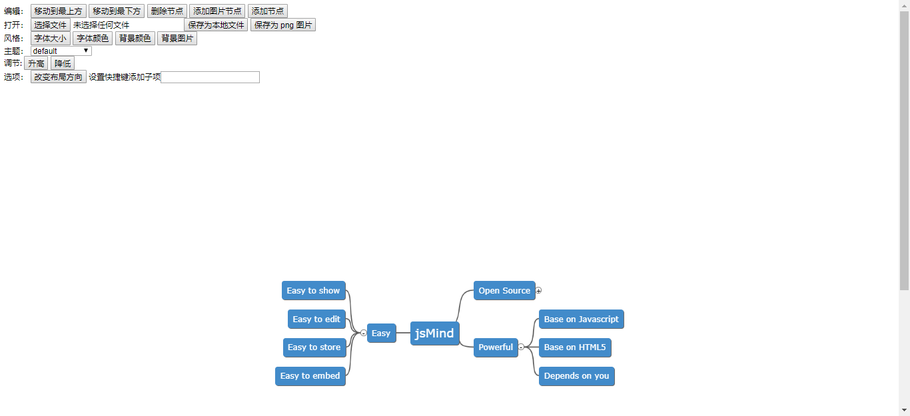

# vue-jsmind

> 一个 Vue 组件 ( 基于 [jsmind](https://github.com/hizzgdev/jsmind ) )

[English](README.md) | 简体中文
# 安装
```bash
yarn add vue-jsmind #or npm install vue-jsmind
```

# 快速开始
```js
import Vue from 'vue'
import jm from 'vue-jsmind'

Vue.use(jm)
```

# 使用
```html
<js-mind :values="mind" :options="options" ref="jsMind" height="1000px"></js-mind>
```

## 参数
- [values](https://github.com/hizzgdev/jsmind/blob/master/docs/en/1.usage.md#12-data-format)
- [options](https://github.com/hizzgdev/jsmind/blob/master/docs/zh/2.options.md)
- [ref](https://github.com/hizzgdev/jsmind/blob/master/docs/zh/3.operation.md#jsmind-%E5%AF%B9%E8%B1%A1) is mounted [jsmind API](https://github.com/hizzgdev/jsmind/blob/master/docs/zh/3.operation.md#jsmind-%E5%AF%B9%E8%B1%A1)


# 使用例子
```bash
git clone git@github.com:chentoday/vue-jsmind.git
yarn #or npm install
yarn run dev #or npm run dev
```
## 结果

